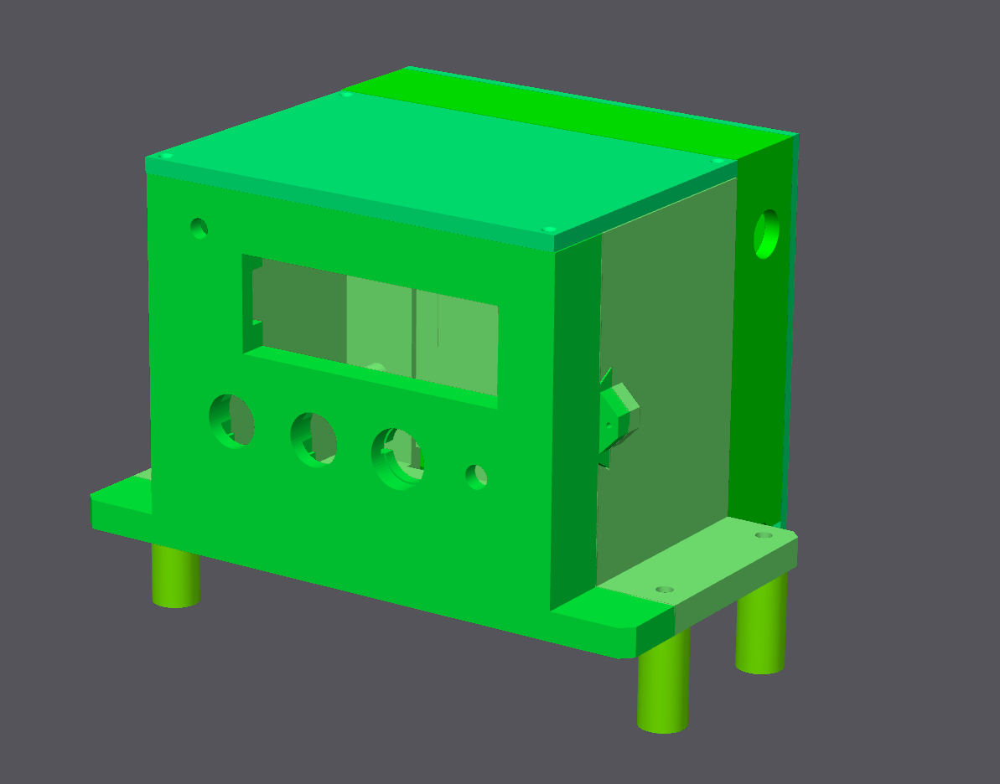

# Honimat-9000

Dieses Projekt ist ein DIY-Motorantrieb mit Steuerung für eine Honigwabenschleuder.

Er ist ausgelegt für den  
[BLDC-Getriebemotor 24V 200W 300RPM 5,18 Nm (733,55 oz.in) mit 10:1 Stirnradgetriebe](https://www.omc-stepperonline.com/de/buerstenloser-gleichstrommotor-mit-24v-200w-300rpm-5-18nm-733-55oz-in-10-1-stirnradgetriebe-f6b200-24gu-30s-6gu10k)  
in Kombination mit dem  
[Brushless Driver BLD-515C](https://www.omc-stepperonline.com/de/digitaler-buerstenloser-dc-motortreiber-24-48vdc-max-15a-400w-bld-515c).

Die Steuereinheit basiert auf einem **Raspberry Pi Pico 2**.  
Dieser verarbeitet:

- zwei **Push-Buttons** zum Wechseln der Modi und zum Starten,  
- ein **Drehpotentiometer** zur Einstellung der Geschwindigkeit im manuellen Modus,  
- einen **Kippschalter** für die Betriebsfreigabe.

Und zeigt die Modi und Informationen über ein **LCD-Display** an.

Der Motortreiber wird über zwei **Relais** sowie eine **5-V-Analogspannung** angesteuert.

- [Raspberry Pi Pico 2](https://www.amazon.de/dp/B0DCKH85WR)
- [LCD 1602 Module](https://www.amazon.de/dp/B0B76Z83Y4)
- [Push-Buttons](https://www.amazon.de/dp/B0B82HLR3M)
- [10K Ohm Potentiometer](https://www.amazon.de/dp/B0D6WB7SZJ)
- [Kippschalter (Toggle Switch)](https://www.amazon.de/dp/B07YZCXP6T)
- [MCP4725 I2C DAC Modul](https://www.amazon.de/dp/B07KFMR87V)
- [4-Kanal Pegelwandler](https://www.amazon.de/dp/B07DKT9JXT)
- [3V Relais](https://www.amazon.de/dp/B0DQL4SVN6)
- [Step Down Buck Converter](https://www.amazon.de/dp/B0F5W7C4KX)
- [Schraubterminals](https://www.amazon.de/dp/B07RR7D267)
- [LED Dioden](https://www.amazon.de/dp/B0CXDS8LDL)
- [24V LED-Schaltnetzteil 300W](https://www.amazon.de/dp/B0CT3CTZ9Z)
- [Not-Stopp-Schalter](https://www.amazon.de/dp/B07LFXB8PF)

---

Die Gehäuseteile sind passgenau auf die obigen Komponenten zugeschnitten.

---

Der Schaltplan ist ebenfalls auf die obigen Komponenten zugeschnitten. Sollten beispielsweise andere Buttons verwendet werden, müssen unter Umständen zusätzliche Pull-Up oder Pull-Down Widerstände eingeplant werden. Diese sind im Breakout-Board der verwendeten Buttons bereits integriert.

**Achtung:** Der +5V Anschluss dess BLDC Motortreibers dient lediglich als Referenzspannung, und kann nicht dafür verwendet werden, den Raspberry Pi oder das Display zu versorgen. Daher wird der zusätzliche **Step Down Buck Converter** benötigt, um +5V für den Raspberry Pi und das Display bereitzustellen
